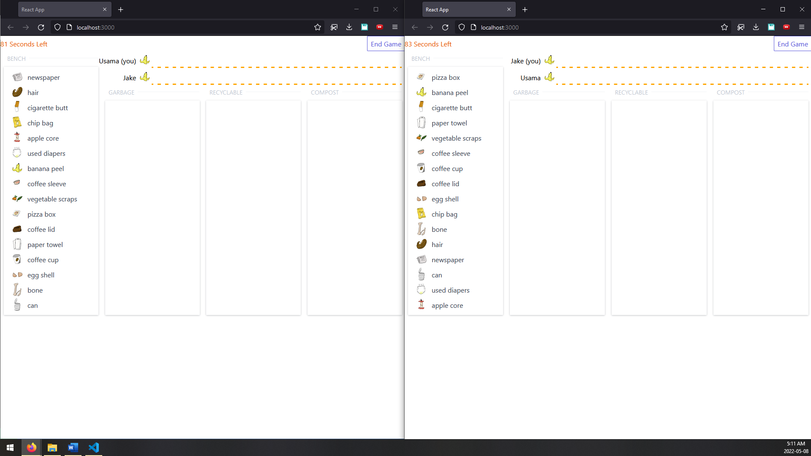
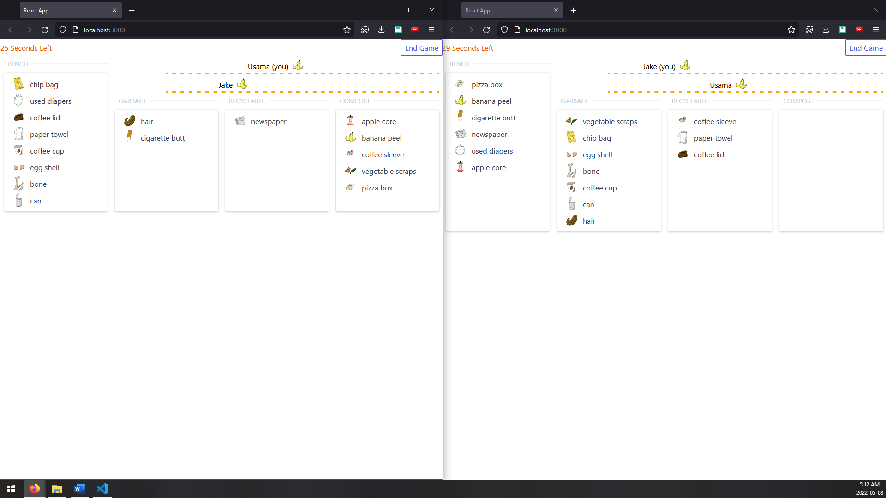
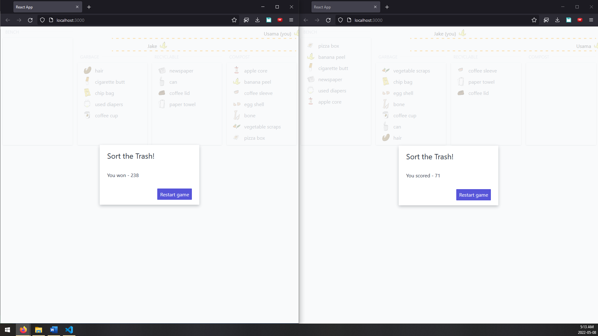

# About

This is a multiplayer game where players compete to quickly sort a list of waste items into the correct bins.

### Start of game


### Live score display


### Someone wins



# Instructions

This project was created with [react-express-starter](https://github.com/philnash/react-express-starter.git).

You can start the server on its own with the command:

```bash
npm run server
```

Run the React application on its own with the command:

```bash
npm start
```

Run both applications together with the command:

```bash
npm run dev
```

The React application will run on port 3000 and the server port 3001.


